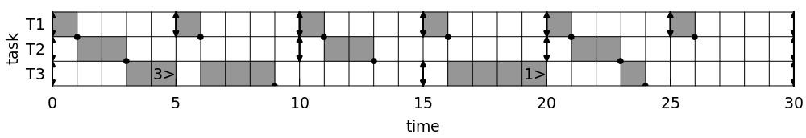

# RT Schedule: a real-time schedule generator for educational purposes#

RT Schedule is a realtime-schedule generator to create and present simple and idealised RT schedules from task lists.  The purpose is to compute the basic properties of a task set and create a schedule using the rate monotonic (RM), earliest deadline first (EDF) and least laxity first (LLF) algorithms.  The program uses simple, idealised systems, since students must be able to schedule them manually.  RT Schedule computes the data and generates clear graphs for lecture notes and exams.

RTschedule can be used under the conditions of the GNU General Public Licence version 3 [(GPLv3)](https://opensource.org/licenses/GPL-3.0).  The program is written in Fortran, needs the [libSUFR](http://libsufr.sourceforge.net) package and uses [PLplot](http://plplot.sourceforge.net/) to generate graphics.  If PLplot is not installed at compile time, the code will be compiled without graphics support.  The default installer uses [CMake](https://cmake.org/).  See the [doc/INSTALL](doc/INSTALL) file for installation instructions.

RT Scheduler can be run from the command line, and requires an input file in order to know what to do.  An example input file example.dat is provided.  The task list includes the first occurrence of a task (t), the computational time (per period; c), the relative deadline (d) and the period (p), all in arbitrary units.  The output from example.dat looks as follows:

	
	$ ./rtschedule example.dat
	
	
     **************************************************************************************************************
     ***   GENERAL TASK DATA                                                                                    ***
     **************************************************************************************************************
   
     Task list:
      Name   ti   ci   di   pi
        T1    0    1    5    5
        T2    0    2   10   10
        T3    0    5   15   15
   
     3 lines (processes) read; scheduling for 30 time units.
   
   
     System load: 0.2000 + 0.2000 + 0.3333 = 0.7333
     The task list is SCHEDULABLE in principle (feasible) :-)
   
   
     Optimal timeslice: 1 time units
     Major frame: 30 time units
     Minor frame: 5 time units
   
   
   
     **************************************************************************************************************
     ***   RM SCHEDULER                                                                                         ***
     **************************************************************************************************************
   
     RM priorities:
      Name   ti   ci   di   pi prio
        T1    0    1    5    5    1
        T2    0    2   10   10    2
        T3    0    5   15   15    3
   
     RM schedulability test for n=3:  SUM Ci/Pi <= n (2^(1/n) - 1):
       0.733 <= 0.780, so task set is GUARANTEED to be schedulable with RM.
   
     Timeslice      T1          T2          T3        Running  Notes
                  cpu  ev     cpu  ev     cpu  ev
   
     0-1          _1_  e       2   e       5   e          T1
     1-2           0          _2_          5              T2   Switch (task T1 done)
     2-3           0          _1_          5              T2
     3-4           0           0          _5_             T3   Switch (task T2 done)
     4-5           0    d      0          _4_             T3
     5-6          _1_  e       0           3              T1   Switch (task T3: 3>)
     6-7           0           0          _3_             T3   Switch (task T1 done)
     7-8           0           0          _2_             T3
     8-9           0           0          _1_             T3
     9-10          0    d      0    d      0               -   Switch (task T3 done)
     10-11        _1_  e       2   e       0              T1   Switch
     11-12         0          _2_          0              T2   Switch (task T1 done)
     12-13         0          _1_          0              T2
     13-14         0           0           0               -   Switch (task T2 done)
     14-15         0    d      0           0    d          -
     15-16        _1_  e       0           5   e          T1   Switch
     16-17         0           0          _5_             T3   Switch (task T1 done)
     17-18         0           0          _4_             T3
     18-19         0           0          _3_             T3
     19-20         0    d      0    d     _2_             T3
     20-21        _1_  e       2   e       1              T1   Switch (task T3: 1>)
     21-22         0          _2_          1              T2   Switch (task T1 done)
     22-23         0          _1_          1              T2
     23-24         0           0          _1_             T3   Switch (task T2 done)
     24-25         0    d      0           0               -   Switch (task T3 done)
     25-26        _1_  e       0           0              T1   Switch
     26-27         0           0           0               -   Switch (task T1 done)
     27-28         0           0           0               -
     28-29         0           0           0               -
     29-30         0    d      0    d      0    d          -
   
     RM ASCII schedule:
     T1   #    #    #    #    #    #    
     T2    ##        ##        ##       
     T3      ## ###       ####   #      
      t  0    5   10   15   20   25   30
   
     RM ASCII schedule:
     T1   #        e#        e#        e#        e#        e#        e
     T2     # #              e  # #              e  # #              e
     T3         # #   # # #            e  # # # #       #            e
      t  0         5        10        15        20        25        30
   
     Graphical schedule saved as example_schedule_RM.png
   
     No deadlines were missed: the system can be scheduled for 30 time units.
     16 task switches (1.76 time units per run).
   
   
   
     **************************************************************************************************************
     ***   EDF SCHEDULER                                                                                        ***
     **************************************************************************************************************
   
     Timeslice         T1             T2             T3        Running  Notes
                  cpu  dl ev     cpu  dl ev     cpu  dl ev
   
     0-1          _1_   5 e       2   10 e       5   15 e          T1
     1-2           0    -        _2_   9         5   14            T2   Switch (task T1 done)
     2-3           0    -        _1_   8         5   13            T2
     3-4           0    -         0    -        _5_  12            T3   Switch (task T2 done)
     4-5           0    -  d      0    -        _4_  11            T3
     5-6          _1_   5 e       0    -         3   10            T1   Switch (task T3: 3>)
     6-7           0    -         0    -        _3_   9            T3   Switch (task T1 done)
     7-8           0    -         0    -        _2_   8            T3
     8-9           0    -         0    -        _1_   7            T3
     9-10          0    -  d      0    -  d      0    -             -   Switch (task T3 done)
     10-11        _1_   5 e       2   10 e       0    -            T1   Switch
     11-12         0    -        _2_   9         0    -            T2   Switch (task T1 done)
     12-13         0    -        _1_   8         0    -            T2
     13-14         0    -         0    -         0    -             -   Switch (task T2 done)
     14-15         0    -  d      0    -         0    -  d          -
     15-16        _1_   5 e       0    -         5   15 e          T1   Switch
     16-17         0    -         0    -        _5_  14            T3   Switch (task T1 done)
     17-18         0    -         0    -        _4_  13            T3
     18-19         0    -         0    -        _3_  12            T3
     19-20         0    -  d      0    -  d     _2_  11            T3
     20-21        _1_   5 e       2   10 e       1   10            T1   Switch (task T3: 1>)
     21-22         0    -        _2_   9         1    9            T2   Switch (task T1 done)
     22-23         0    -        _1_   8         1    8            T2
     23-24         0    -         0    -        _1_   7            T3   Switch (task T2 done)
     24-25         0    -  d      0    -         0    -             -   Switch (task T3 done)
     25-26        _1_   5 e       0    -         0    -            T1   Switch
     26-27         0    -         0    -         0    -             -   Switch (task T1 done)
     27-28         0    -         0    -         0    -             -
     28-29         0    -         0    -         0    -             -
     29-30         0    -  d      0    -  d      0    -  d          -
   
     EDF ASCII schedule:
     T1   #    #    #    #    #    #    
     T2    ##        ##        ##       
     T3      ## ###       ####   #      
      t  0    5   10   15   20   25   30
   
     EDF ASCII schedule:
     T1   #        e#        e#        e#        e#        e#        e
     T2     # #              e  # #              e  # #              e
     T3         # #   # # #            e  # # # #       #            e
      t  0         5        10        15        20        25        30
   
     Graphical schedule saved as example_schedule_EDF.png
   
     No deadlines were missed: the system can be scheduled for 30 time units.
     16 task switches (1.76 time units per run).
   
   
   
     **************************************************************************************************************
     ***   LLF SCHEDULER                                                                                        ***
     **************************************************************************************************************
   
     Timeslice         T1             T2             T3        Running Lax  Notes
                  lax cpu ev     lax cpu ev     lax cpu ev
   
     0-1          _4_  1  e       8   2  e       10  5  e          T1   4
     1-2           -   -         _7_  2          9   5             T2   7   Switch (task T1 done)
     2-3           -   -         _7_  1          8   5             T2   7
     3-4           -   -          -   -         _7_  5             T3   7   Switch (task T2 done)
     4-5           -   -   d      -   -         _7_  4             T3   7
     5-6          _4_  1  e       -   -          7   3             T1   4   Switch (task T3: 3>)
     6-7           -   -          -   -         _6_  3             T3   6   Switch (task T1 done)
     7-8           -   -          -   -         _6_  2             T3   6
     8-9           -   -          -   -         _6_  1             T3   6
     9-10          -   -   d      -   -   d      -   -              -   -   Switch (task T3 done)
     10-11        _4_  1  e       8   2  e       -   -             T1   4   Switch
     11-12         -   -         _7_  2          -   -             T2   7   Switch (task T1 done)
     12-13         -   -         _7_  1          -   -             T2   7
     13-14         -   -          -   -          -   -              -   -   Switch (task T2 done)
     14-15         -   -   d      -   -          -   -   d          -   -
     15-16        _4_  1  e       -   -          10  5  e          T1   4   Switch
     16-17         -   -          -   -         _9_  5             T3   9   Switch (task T1 done)
     17-18         -   -          -   -         _9_  4             T3   9
     18-19         -   -          -   -         _9_  3             T3   9
     19-20         -   -   d      -   -   d     _9_  2             T3   9
     20-21        _4_  1  e       8   2  e       9   1             T1   4   Switch (task T3: 1>)
     21-22         -   -         _7_  2          8   1             T2   7   Switch (task T1 done)
     22-23         -   -         _7_  1          7   1             T2   7   Choice: keep same task
     23-24         -   -          -   -         _6_  1             T3   6   Switch (task T2 done)
     24-25         -   -   d      -   -          -   -              -   -   Switch (task T3 done)
     25-26        _4_  1  e       -   -          -   -             T1   4   Switch
     26-27         -   -          -   -          -   -              -   -   Switch (task T1 done)
     27-28         -   -          -   -          -   -              -   -
     28-29         -   -          -   -          -   -              -   -
     29-30         -   -   d      -   -   d      -   -   d          -   -
   
     LLF ASCII schedule:
     T1   #    #    #    #    #    #    
     T2    ##        ##        ##       
     T3      ## ###       ####   #      
      t  0    5   10   15   20   25   30
   
     LLF ASCII schedule:
     T1   #        e#        e#        e#        e#        e#        e
     T2     # #              e  # #              e  # #              e
     T3         # #   # # #            e  # # # #       #            e
      t  0         5        10        15        20        25        30
   
     Graphical schedule saved as example_schedule_LLF.png
   
     No deadlines were missed: the system can be scheduled for 30 time units.
     16 task switches (1.76 time units per run).
     
     
     

